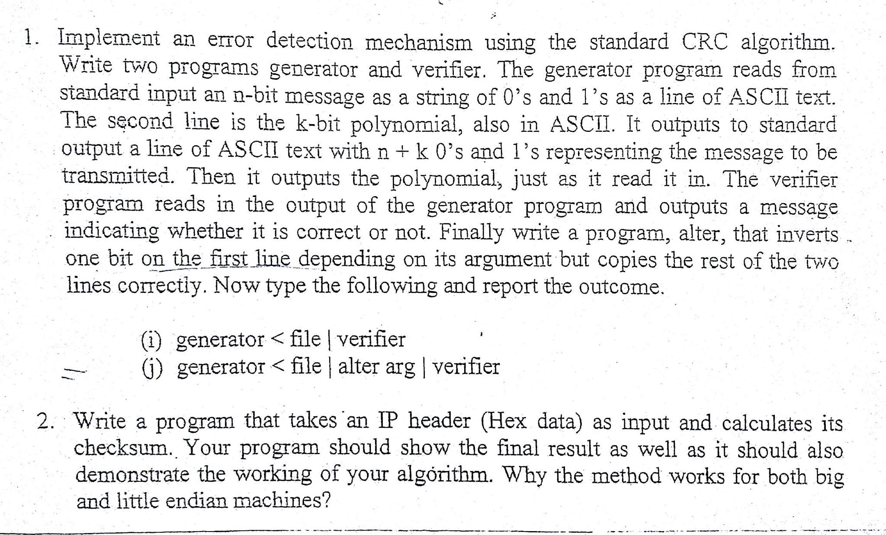
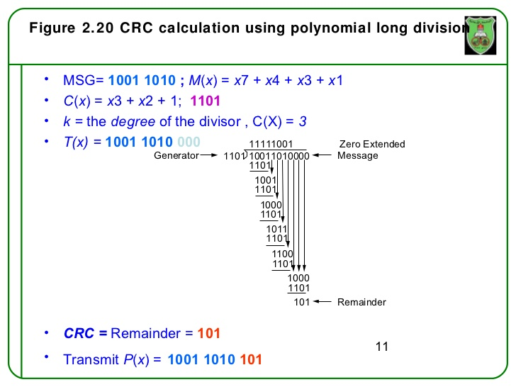
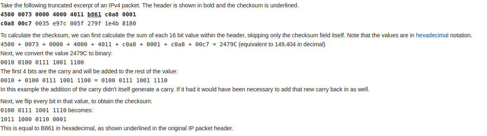

# Lab - 2

### Lab questions:

## Task-1
Use of `CRC` algorithm. Programs : 
 - `generator.cpp` : Generates `data + crc` from `data` and `polynomial` as inputs.
 - `verifier.cpp` : Verifies the correctness of `data + crc` from `data + crc` and `polynomial` as inputs.
 

## Task-2
Calculate the `checksum` of the IP Header. Method,
